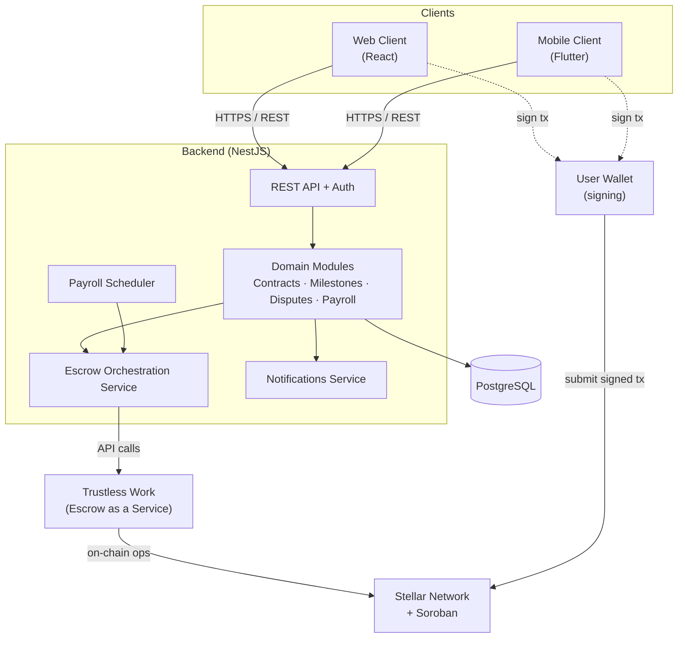
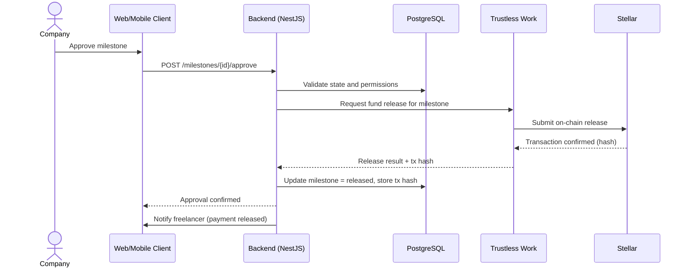

# Architecture

This document describes the system architecture of BolPay: its layers, components,
external dependencies, and the main data and control flows between them.

## 1. Architectural Overview

BolPay follows a layered, service-oriented architecture. Two client applications
(web and mobile) communicate with a single backend API. The backend owns all
business logic, persists state in PostgreSQL, and orchestrates on-chain operations
through Trustless Work, which in turn interacts with the Stellar network. The
backend never holds private keys; transaction signing is delegated to the user's
connected wallet.

## 2. Layers

### 2.1 Presentation Layer

| Component | Technology | Responsibility |
|---|---|---|
| Web client | React | Responsive interface for companies, freelancers, and administrators. Connects a Stellar wallet for signing. |
| Mobile client | Flutter | Cross-platform application for the same flows, optimized for mobile use. |

Both clients are stateless with respect to business rules: they render data
provided by the API and delegate every decision to the backend. Wallet signing
happens client-side so that private keys never reach the server.

### 2.2 Application / Backend Layer

The backend is a NestJS application organized into modules that map directly to the
system's functional areas.

| Module | Responsibility |
|---|---|
| Auth | Authentication, session management, and role-based access control. |
| Users | Profiles, wallet association, and email invitations. |
| Contracts | Contract lifecycle and state transitions. |
| Milestones | Milestone definition, deliverable submission, and review. |
| Escrow Orchestration | Translates domain events into Trustless Work operations and records transaction hashes. |
| Disputes | Dispute lifecycle, evidence handling, and resolution execution. |
| Payroll | Payroll schedules, recipients, and execution history. |
| Payroll Scheduler | Triggers payroll execution on the configured date and frequency. |
| Notifications | Real-time event delivery to clients. |
| Activity Logs | Append-only record of significant domain events. |

### 2.3 Data Layer

PostgreSQL is the system of record for off-chain state: users, contracts,
milestones, disputes, payroll definitions, notifications, and logs. On-chain
references (escrow identifiers and transaction hashes) are stored alongside the
corresponding domain entities so that off-chain state can be reconciled with the
ledger. The full schema is documented in [data-model.md](data-model.md).

### 2.4 Blockchain Layer

| Component | Responsibility |
|---|---|
| Trustless Work | Escrow as a Service. Creates escrows, accepts funding, and releases funds according to milestone approvals and dispute resolutions. |
| Stellar + Soroban | Settlement network. Executes USDC transfers and records immutable transaction hashes. |
| User wallet | Holds funds and signs transactions. Funding and release operations are authorized by the wallet, not the backend. |

## 3. Key Cross-Cutting Concerns

### 3.1 Authentication and Authorization

Authentication is handled by the Auth module. Every protected endpoint enforces
role-based access control so that, for example, only a company can approve a
milestone and only the contract's freelancer can submit its deliverables.

### 3.2 On-Chain Consistency

On-chain operations are asynchronous and can fail or take time to confirm. The
backend treats the Stellar transaction hash as the source of truth for settlement.
Domain state transitions that depend on settlement (for example, marking a
milestone as released) are only finalized once the corresponding transaction is
confirmed. Detailed sequences are described in [escrow.md](escrow.md).

### 3.3 Scheduling and Idempotency

The payroll scheduler triggers distributions on the configured date. Executions are
designed to be idempotent so that a retry after a partial failure does not produce
duplicate payments. Each execution records its transaction hashes for audit.

### 3.4 Notifications and Logging

Domain modules emit events that the Notifications service delivers to clients in
real time, and that the Activity Logs module persists as an append-only history.
These concerns are decoupled from the core transaction flow so that a notification
or logging failure cannot block a payment.

## 4. Request Flow Example: Milestone Approval

The following sequence illustrates how a company approving a milestone results in
an on-chain release.

## 5. Deployment View (Development)

During development and testing the system targets the Stellar Testnet. The backend,
database, and clients run in a development environment; no production environment is
delivered as part of this project. Environment-specific configuration (API
endpoints, Trustless Work credentials, network selection) is provided through
environment variables and is never committed to the repository.

## 6. Technology Rationale

| Decision | Rationale |
|---|---|
| NestJS backend | Modular architecture maps cleanly to the system's functional areas and provides strong TypeScript support shared with the web client. |
| PostgreSQL | Relational integrity fits the contract, milestone, and payroll relationships, with mature support for migrations. |
| Trustless Work | Provides escrow as a service, removing the need to author and audit custom escrow contracts from scratch. |
| Stellar + USDC | Low-cost, fast settlement with a stable-value asset, suitable for international payments. |
| React + Flutter | Cover web and both mobile platforms while keeping shared domain types in a common package. |
