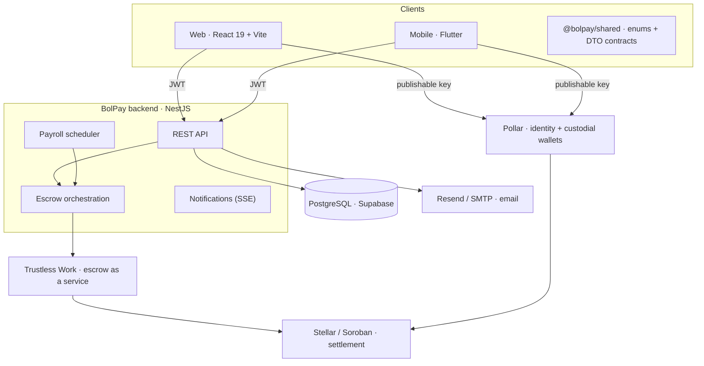
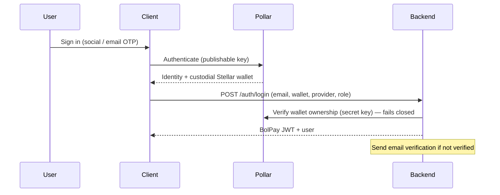
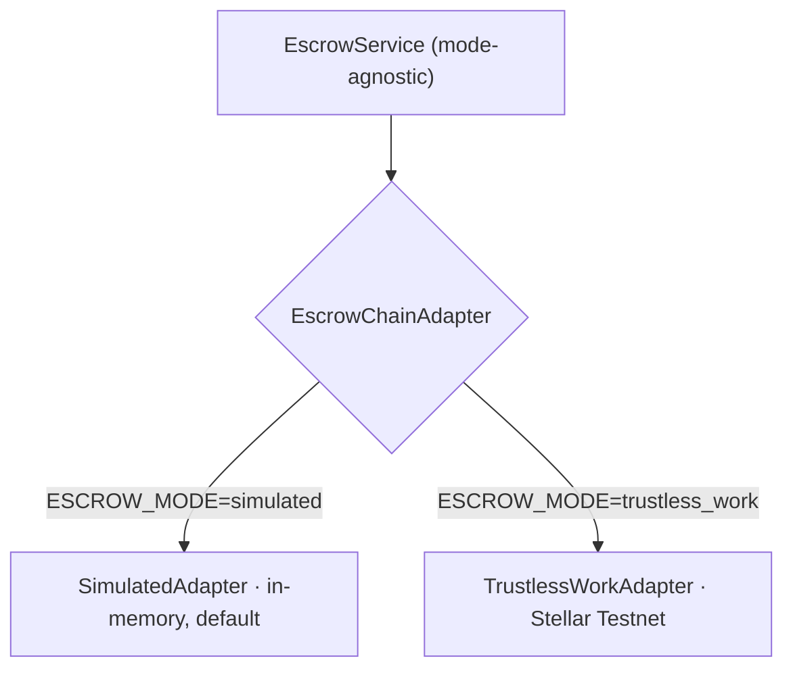
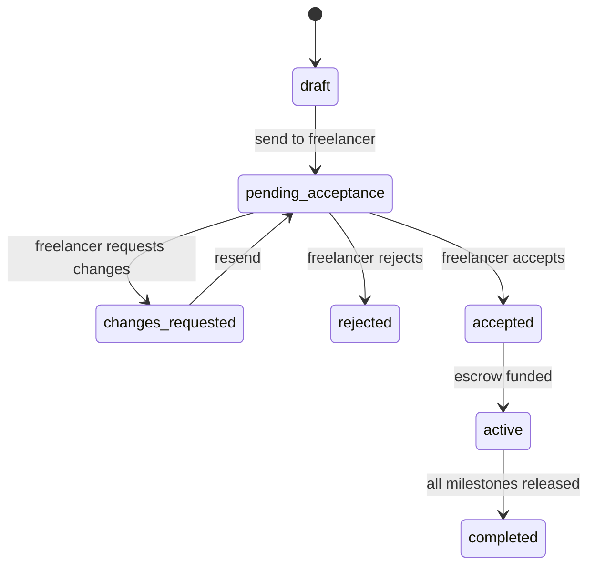
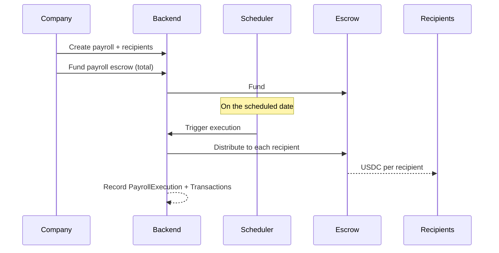
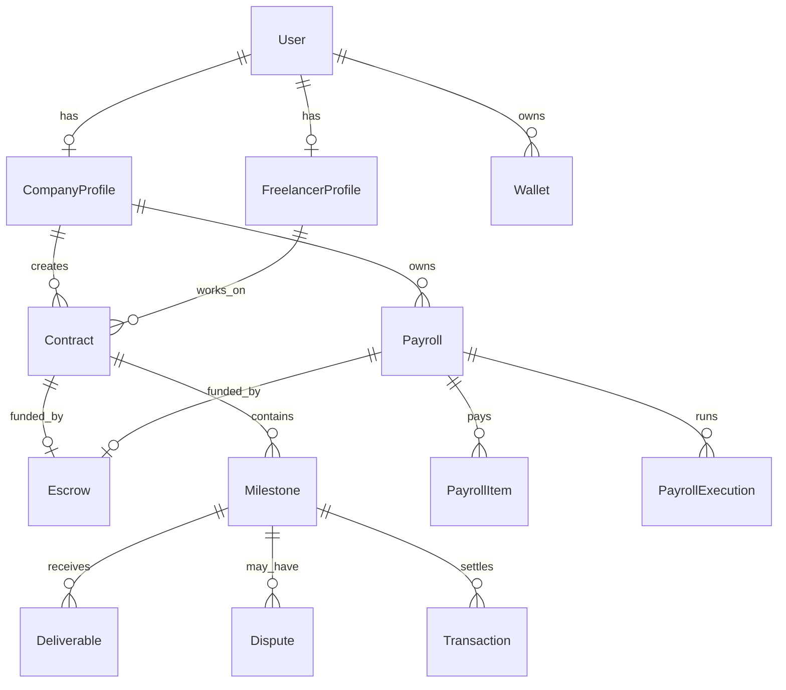

# Technical Architecture

How BolPay settles freelance work and payroll in **USDC** on **Stellar**: milestone
escrow, custodial and self-custodial wallets, and an off-chain domain model that
stays verifiably in step with the ledger.

This is the system-level reference. Focused deep-dives live in
[data-model.md](data-model.md), [authentication.md](authentication.md), and
[escrow.md](escrow.md).

## Contents

1. [Overview](#1-overview)
2. [System architecture](#2-system-architecture)
3. [Monorepo layout](#3-monorepo-layout)
4. [Backend modules](#4-backend-modules)
5. [Authentication & identity](#5-authentication--identity)
6. [Escrow & settlement](#6-escrow--settlement)
7. [Contract lifecycle](#7-contract-lifecycle)
8. [Disputes](#8-disputes)
9. [Payroll](#9-payroll)
10. [Data model](#10-data-model)
11. [Notifications & audit](#11-notifications--audit)
12. [Clients](#12-clients)
13. [Security model](#13-security-model)
14. [Configuration](#14-configuration)
15. [Technology stack](#15-technology-stack)
16. [Glossary](#16-glossary)

---

## 1. Overview

BolPay is a settlement platform for freelance contracts and recurring payroll. A
company and a freelancer agree on a contract split into **milestones**; the company
funds an on-chain escrow, and each milestone is released to the freelancer as its
deliverable is approved. Companies also run **payroll** cycles that distribute funds
to many recipients on a schedule. All value moves in **USDC**, a native Stellar
asset.

The design goal is a product that behaves like ordinary software while every
movement of money is a verifiable on-chain event. BolPay owns the off-chain state
(accounts, contracts, milestones, disputes, payroll) and delegates custody and
settlement to specialized providers, storing an on-chain reference next to each
entity so the database and the ledger can always be reconciled.

> **Invariants**
>
> - **Funds never move without the payer's action.** Escrow deploy, funding, and
>   each release are explicit, user-triggered operations; nothing auto-submits value.
> - **The backend never holds private keys.** Signing happens in the user's
>   custodial wallet or their own wallet; the backend orchestrates and records, it
>   does not sign for users.
> - **Every on-chain operation is recorded.** Each fund, release, refund, and
>   payroll distribution is stored as a transaction with its Stellar hash.

---

## 2. System architecture

BolPay is organized as clients, a single backend that owns all domain state, and a
set of off-platform services for identity, escrow, settlement, and email. Clients
never talk to the database or to the chain directly; they hold a BolPay session and
call the REST API.



Clients authenticate with **Pollar** (which provisions a custodial Stellar wallet)
and exchange that identity for a BolPay JWT. All domain operations go through the
REST API, which owns the off-chain state in PostgreSQL and delegates on-chain
settlement to **Trustless Work**.

---

## 3. Monorepo layout

The repository is a **Bun** + **Turborepo** workspace. The `@bolpay/shared` package
is the single source of truth for domain enums and DTO shapes, consumed by the
backend and the web client so the database, API, and UI cannot drift apart.

```
BolPay/
├── apps/
│   ├── backend/   # NestJS API, escrow orchestration, payroll scheduler
│   ├── web/       # React web client (Vite)
│   └── mobile/    # Flutter client (feature parity with web)
├── packages/
│   └── shared/    # enums, model contracts, API types
└── docs/          # engineering documentation
```

The mobile client mirrors the web feature set against the same API. Because Dart
does not consume the TypeScript `shared` package, it keeps its own models generated
to match the shared contracts.

---

## 4. Backend modules

The backend follows NestJS's modular architecture: each domain is a self-contained
module with its own controller, service, and DTOs.

| Module | Responsibility |
|---|---|
| `auth` | Session issuance (JWT), Pollar wallet verification, email verification, role resolution. |
| `users` | Company / freelancer profiles, directory listings, email invitations. |
| `contracts` | Contract lifecycle: draft → acceptance → active → completed. |
| `milestones` | Milestone state, deliverable submission and review. |
| `escrow` | Escrow records and the on-chain adapter abstraction. |
| `disputes` | Dispute lifecycle, evidence, and mutual or escalated resolution. |
| `payroll` | Payroll schedules, recipients, funding, and the distribution scheduler. |
| `notifications` | Real-time user notifications over server-sent events. |
| `activity-logs` | Append-only audit trail of domain events. |
| `mail` | Transactional email (verification, sign-in codes, invitations). |

Cross-cutting concerns are provided by NestJS guards and decorators:

- **`JwtAuthGuard`** validates the bearer token on every non-public route.
- **`RolesGuard`** + `@Roles()` enforce role-based access.
- **`@Public()`** opts a route out of authentication (login, health, email codes).
- **`@CurrentUser()`** injects the authenticated principal into handlers.
- **`@Throttle()`** rate-limits sensitive endpoints (login, code requests).

---

## 5. Authentication & identity

BolPay separates **identity & key custody**, **session authorization**, and **email
ownership**. Keeping them independent is what lets the same backend serve a custodial
wallet, a self-custodial wallet, and a self-declared address on equal footing.



### Identity & wallets — Pollar

Pollar is a wallet-onboarding SDK for Stellar. The client authenticates with a
**publishable key** (social login or email OTP); Pollar provisions a **custodial
Stellar wallet** and handles trustlines and sponsored fees. The backend holds a
**secret key** and verifies at login that the claimed address belongs to the
presented wallet id.

> **Fails closed** — When the secret key is configured (required in production), a
> missing wallet id, an unreachable Pollar server, or an address mismatch all
> **reject login**. Rebinding an existing account to a new wallet also requires
> server-side verification, so knowing a victim's email cannot hijack their payout
> address.

### Sessions — BolPay JWT

After wallet verification, the backend issues a signed JWT carrying the user id,
email, and role. Roles are resolved on first login: an **invitation token wins** (its
role must match the email and be unexpired); otherwise the role comes from the
request. Self-custodial wallets (via Stellar Wallets Kit) prove ownership by signing
a server challenge instead of presenting a Pollar wallet.

### Email ownership — verification & sign-in codes

Because Pollar exposes no backend-verifiable identity token, BolPay verifies email
itself. Two mechanisms share the mail layer:

- **Verification link** — on registration, a single-use, expiring token is emailed;
  confirming it sets `emailVerified`. Sensitive actions (funding escrow, sending
  invitations) are gated behind it.
- **Sign-in code** — the manual (self-declared wallet) path emails a six-digit code
  that must be confirmed before the session is created. The code is stored as an
  **HMAC keyed by the server secret** (a leaked table cannot recover it), expires in
  ten minutes, allows five attempts, and is single-use.

See [authentication.md](authentication.md) for the full flow and configuration.

---

## 6. Escrow & settlement

A BolPay escrow is a Trustless Work (Soroban) contract that locks funds until release
conditions are met. Contract escrows are **multi-release** — each milestone is an
independently releasable tranche — while payroll escrows fund a scheduled
distribution to many recipients. Both are the same model, distinguished by type.

Settlement is hidden behind an adapter, `EscrowChainAdapter`, selected by the
`ESCROW_MODE` environment variable. Every mode exposes the same operations —
`deploy`, `fund`, `release`, `refund`, `distribute` — so application logic is written
once.



| Mode | Behavior |
|---|---|
| `simulated` (default) | In-memory escrow; the whole product flow works without touching the chain. Used for local development and functional testing. |
| `trustless_work` | Real multi-release escrows on the Stellar Testnet via the Trustless Work API. Requires an API key and a funded platform signer. |

> **Precision** — Amounts use seven decimal places throughout (`Decimal(20, 7)`),
> matching Stellar's native asset precision, to avoid rounding drift between the
> database and on-chain operations.

---

## 7. Contract lifecycle

A contract advances through an explicit state machine. Milestones carry their own
state, and the contract completes when every milestone is released.



Milestone status moves `pending → submitted → in_review → approved → released`.
Opening a dispute moves a milestone to `disputed` and pauses its release.

```mermaid
sequenceDiagram
    participant F as Freelancer
    participant API as Backend
    participant E as Escrow Adapter
    participant C as Company

    F->>API: Accept contract
    API->>E: Deploy multi-release escrow (one tranche per milestone)
    C->>API: Fund escrow (total)
    E-->>API: funded (locked)
    F->>API: Submit deliverable (per milestone)
    C->>API: Approve milestone
    API->>E: Release milestone tranche
    E-->>F: USDC to freelancer wallet
    Note over API: Repeat per milestone; contract completes when all released
```

Milestone receivers are the freelancers' wallets, so released funds land directly in
their accounts.

---

## 8. Disputes

Opening a dispute on a milestone pauses its release and keeps the funds locked;
neither party can release unilaterally. Both sides attach evidence (files and
comments). Resolution is by mutual agreement, or escalated for platform review when
no agreement is reached — the agreed outcome is then executed on the escrow.

| Outcome | Effect on the tranche |
|---|---|
| `release_to_freelancer` | The milestone tranche is released to the freelancer. |
| `refund_to_company` | The tranche is refunded to the company. |
| `split` | The tranche is divided between both parties by agreed amounts (validated to sum to the tranche). |

---

## 9. Payroll

A payroll is a recurring schedule owned by a company. Each recipient line is either a
linked platform user (a fixed employee) or an external wallet, with an individual
amount. The company funds the payroll escrow once; a scheduler evaluates funded
payrolls and triggers distribution on the scheduled date.



Failed or partial executions are tracked (`failed`, `partial`) so they can be retried
without double-paying recipients who already received funds.

---

## 10. Data model

BolPay stores its off-chain state in PostgreSQL, modeled with Prisma. On-chain
references (escrow id, Stellar transaction hash) live alongside the entities they
relate to. A single `Escrow` model backs both contracts and payroll, distinguished
by `EscrowType`.



| Entity | Description |
|---|---|
| **User** | Account root: email, role, auth provider, linked Stellar address / wallet id. At most one company or freelancer profile. |
| **Wallet** | Stellar address(es) linked to a user; one marked primary. |
| **Contract** | Company–freelancer agreement with a total, optional deadline, status, and optional escrow reference. |
| **Milestone** | Ordered, independently releasable unit of work; its position matches the on-chain milestone index. |
| **Deliverable** | Versioned submission (file and/or link) attached to a milestone, with review status. |
| **Escrow** | Reference to a Trustless Work escrow: type, status, asset, funded / released amounts. |
| **Transaction** | Audit record of an on-chain operation with its Stellar hash and confirmation time. |
| **Dispute** · **DisputeEvidence** | A contested milestone with status, outcome, split amounts, resolver, and attached evidence. |
| **Payroll** · **PayrollItem** · **PayrollExecution** | Schedule, recipient lines, and individual runs with distributed totals. |
| **Invitation** | Tokenized email binding an address to a role until accepted or expired. |
| **Notification** · **ActivityLog** | Per-user messages and an append-only event trail. |

### Key enumerations

| Enum | Values |
|---|---|
| `UserRole` | `company`, `freelancer`, `fixed_employee` |
| `ContractStatus` | `draft`, `pending_acceptance`, `changes_requested`, `accepted`, `active`, `completed`, `rejected` |
| `MilestoneStatus` | `pending`, `submitted`, `in_review`, `approved`, `released`, `disputed` |
| `EscrowStatus` | `created`, `funded`, `releasing`, `released`, `disputed`, `closed` |
| `DisputeOutcome` | `release_to_freelancer`, `refund_to_company`, `split` |
| `PayrollStatus` | `draft`, `funded`, `active`, `paused`, `completed` |
| `TransactionOperation` | `fund`, `release`, `refund`, `payroll_distribution` |

Enum values are shared with the clients through `@bolpay/shared` to keep the
database, API, and UI in sync. See [data-model.md](data-model.md) for the full model.

---

## 11. Notifications & audit

The backend emits per-user **notifications** as domain events occur — a contract
sent, a milestone approved, a dispute opened. The web client subscribes over
**server-sent events** for live updates; the mobile client falls back to a short
**polling** interval, since long-lived SSE connections are awkward on mobile. Marking
a notification read is optimistic on both clients.

Separately, an append-only **activity log** records domain events (for example
`user.registered`, `wallet.linked`) for auditing. Unlike notifications, it is never
mutated or deleted.

---

## 12. Clients

The **web** client (React 19 + Vite) and the **mobile** client (Flutter) target the
same backend and aim for feature parity: authentication, contracts and milestones,
deliverables, disputes, payroll, escrow status, and live notifications. Both render
the **"Andean Precision"** design system — a restrained palette, hairline 1px borders
instead of shadows, and consistent radii — so the two surfaces read as one product.

### Wallet signing on mobile

On-chain actions require a signature, and the mobile client resolves it by the wallet
source:

| Context | How the action is signed |
|---|---|
| `simulated` mode | Nothing to sign — the confirm proceeds without a transaction hash. |
| Custodial wallet · `trustless_work` | The wallet service signs *and* broadcasts the transaction on-device; the resulting hash is passed to the confirm. |
| Self-declared wallet | The action is completed on the web app, where the user's own wallet can sign. |

Money-moving tokens on mobile are held in the platform keystore (encrypted storage),
never in plaintext preferences.

---

## 13. Security model

| Surface | Control |
|---|---|
| Wallet ownership | Pollar verification **fails closed** in production; self-custodial login requires a signed challenge that is consumed after use. |
| Email ownership | Verification link plus, on the manual path, an HMAC-hashed six-digit code with TTL and attempt limits. |
| Sensitive actions | Gated behind a verified email (funding escrow, sending invitations). |
| Abuse / rate | Per-route throttling on login and code endpoints; short timeouts and no automatic retries (no self-inflicted amplification). |
| Double submission | Reentrancy guards on non-atomic actions; on-chain confirms are idempotent and guarded so a value operation cannot run twice. |
| Key custody | The backend never stores user private keys; the mobile client keeps tokens in the OS keystore and blocks screenshots on sensitive screens. |
| Transport | TLS is never disabled; release builds enforce HTTPS and exclude app data from cloud backup. |

---

## 14. Configuration

Configuration is provided per app through environment variables and, on mobile,
build-time defines.

| Variable | Where | Purpose |
|---|---|---|
| `DATABASE_URL` | backend | PostgreSQL connection (Supabase). |
| `JWT_SECRET` / `JWT_EXPIRES_IN` | backend | Session token signing and lifetime. |
| `POLLAR_SECRET_KEY` | backend | Server-side wallet verification (required in production). |
| `ESCROW_MODE` | backend | `simulated` or `trustless_work`. |
| `TRUSTLESS_WORK_API_KEY` | backend | Live escrow operations on Testnet. |
| SMTP settings | backend | Transactional email; when unset, emails are logged in development. |
| `POLLAR_PUBLISHABLE_KEY` | web · mobile | Client-side wallet authentication. |
| `API_URL` | web · mobile | Backend base URL (`10.0.2.2` from the Android emulator). |

See [development.md](development.md) for the full environment reference.

---

## 15. Technology stack

| Layer | Technology |
|---|---|
| Workspace | Bun · Turborepo |
| Backend | NestJS 11 · Prisma 6 · PostgreSQL (Supabase) |
| Web | React 19 · Vite · TypeScript |
| Mobile | Flutter · Dart |
| Identity & wallets | Pollar (custodial) · Stellar Wallets Kit (self-custodial) |
| Escrow & settlement | Trustless Work · Soroban · Stellar · USDC |
| Email | Resend / SMTP (Nodemailer) |

---

## 16. Glossary

| Term | Definition |
|---|---|
| **Custodial wallet** | A Stellar wallet whose keys are managed on the user's behalf by Pollar. |
| **Escrow** | A Trustless Work (Soroban) contract that locks funds until release conditions are met. |
| **Multi-release escrow** | An escrow that releases funds in tranches, one per milestone. |
| **Milestone** | An ordered, independently releasable unit of work within a contract. |
| **Fixed employee** | A role paid through recurring payroll rather than per-contract milestones. |
| **Trustline** | A Stellar ledger entry authorizing an account to hold a given asset (e.g. USDC). |
| **Soroban** | Stellar's smart-contract platform, on which Trustless Work escrows run. |
| **USDC** | A US-dollar stablecoin used as the unit of account; a native asset on Stellar. |

For the complete terminology list, see [glossary.md](glossary.md).
