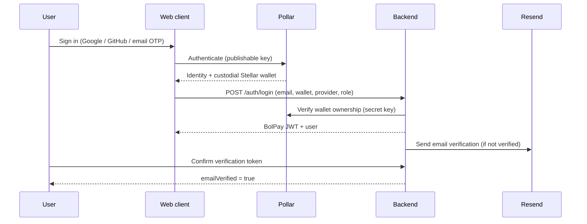

# Authentication

BolPay separates three concerns: **identity & key custody** (Pollar), **session
authorization** (BolPay JWT), and **email verification** (Resend). This document
describes each and how they fit together.

## 1. Overview

## 2. Identity & Wallets - Pollar

[Pollar](https://pollar.xyz) is a wallet-onboarding SDK for Stellar. In BolPay it is
responsible for **authentication and custodial wallet provisioning only**:

- The web client authenticates with Pollar using a **publishable key**. Pollar
  supports social login (Google, GitHub) and email OTP.
- Pollar provisions a **custodial Stellar wallet** for the user and handles
  trustlines and sponsored fees. BolPay never stores private keys.
- The backend holds a **secret key** and verifies, at login, that the claimed
  Stellar address belongs to the presented Pollar wallet id. This check **fails
  closed**: when the secret key is configured (required in production), a missing
  wallet id, an unreachable Pollar server, or an address mismatch all reject login.

Profile information (company / freelancer / fixed-employee details) is **not**
provided by Pollar - it is collected through BolPay's own forms and stored in the
database.

> **Known limitation:** Pollar's public API does not expose a backend-verifiable
> identity token (ID token + JWKS). The strongest available binding is therefore
> `wallet id ↔ address` via the secret key. This is why email ownership is verified
> separately (see §4).

## 3. Sessions - BolPay JWT

After Pollar verification, the backend issues a signed **JWT** containing the user
id, email, and role. The token is sent as a bearer token on every request and
validated by `JwtAuthGuard`. Authorization is role-based via `RolesGuard` and the
`@Roles()` decorator.

**Roles** are resolved on first login:

- An **invitation token** wins: the role is taken from the invitation, which must
  match the email and not be expired or used.
- Otherwise the role comes from the request payload (company or freelancer).

Rebinding an existing account to a different wallet requires server-side Pollar
verification, preventing payout-address hijacking by email alone.

## 4. Email Verification - Resend

Pollar's email OTP only proves control of the **login** inbox at sign-in time, and
the backend cannot independently verify it. BolPay therefore verifies email
addresses itself using [Resend](https://resend.com):

- On registration (and when a user changes their email), the backend sends a
  verification message containing a single-use, expiring token.
- The user confirms by following the link / entering the code, which sets
  `emailVerified = true`.
- **Sensitive actions are gated** behind a verified email - for example funding an
  escrow or sending invitations.
- **Invitations** to freelancers and fixed employees are also delivered through
  Resend, carrying the tokenized invitation that binds the email to a role.

This keeps a clear separation: Pollar guarantees the wallet, BolPay guarantees the
email.

## 5. Configuration

| Variable | Where | Purpose |
|---|---|---|
| `POLLAR_PUBLISHABLE_KEY` | web | Client-side Pollar authentication. |
| `POLLAR_SECRET_KEY` | backend | Server-side wallet verification (required in production). |
| `POLLAR_API_URL` | backend | Pollar Server API base URL. |
| `JWT_SECRET` / `JWT_EXPIRES_IN` | backend | Session token signing and lifetime. |
| `RESEND_API_KEY` | backend | Transactional email (verification + invitations). |

See [development.md](development.md) for the full environment reference.
