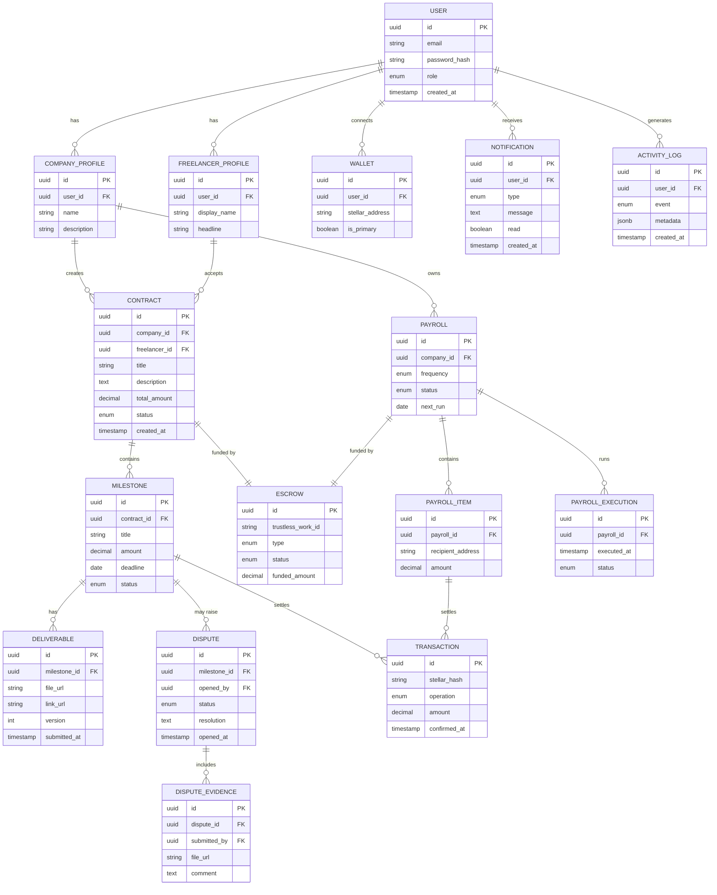

# Data Model

This document describes the relational data model for BolPay. It presents the
entity-relationship (ER) diagram, the core entities, and the relationships between
them. The model represents off-chain state; on-chain references such as escrow
identifiers and transaction hashes are stored alongside the entities they relate to.

## 1. Entity-Relationship Diagram

## 2. Core Entities

| Entity | Description |
|---|---|
| **User** | Base account with credentials and a role (company, freelancer, fixed employee, administrator). |
| **Wallet** | Stellar address connected by a user; required for on-chain operations. |
| **Company Profile** | Company-specific attributes attached to a user account. |
| **Freelancer Profile** | Professional attributes attached to a user account. |
| **Contract** | Agreement between a company and a freelancer, with a total amount and lifecycle status. |
| **Milestone** | A funded checkpoint within a contract, with an amount, deadline, and status. |
| **Deliverable** | A versioned submission (file or link) for a milestone. |
| **Escrow** | Reference to a Trustless Work escrow funding a contract or payroll. |
| **Dispute** | A conflict raised on a milestone, with status and resolution. |
| **Dispute Evidence** | Files and comments attached to a dispute by either party. |
| **Payroll** | A recurring distribution schedule owned by a company. |
| **Payroll Item** | A single recipient and amount within a payroll. |
| **Payroll Execution** | A record of one run of a payroll schedule. |
| **Transaction** | An on-chain settlement with its Stellar hash and confirmation time. |
| **Notification** | A message delivered to a user about a domain event. |
| **Activity Log** | An append-only record of significant domain events. |

## 3. Key Relationships

- A **User** may have a company profile or a freelancer profile, and connects one
  or more **Wallets**.
- A **Contract** is created by a company and accepted by a freelancer. It contains
  one or more **Milestones** and is funded by exactly one **Escrow**.
- A **Milestone** has one or more **Deliverables** (versions), may raise a
  **Dispute**, and settles through one or more **Transactions** when released.
- A **Dispute** belongs to a milestone and aggregates **Dispute Evidence** from
  both parties.
- A **Payroll** is owned by a company, is funded by an **Escrow**, contains one or
  more **Payroll Items**, and produces a **Payroll Execution** each time it runs.
- **Transactions** record the on-chain settlement for both milestone releases and
  payroll distributions, providing a single audit trail keyed by Stellar hash.

## 4. Enumerations

| Enumeration | Values |
|---|---|
| `User.role` | `company`, `freelancer`, `fixed_employee`, `administrator` |
| `Contract.status` | `draft`, `accepted`, `active`, `completed` |
| `Milestone.status` | `pending`, `submitted`, `in_review`, `approved`, `released`, `disputed` |
| `Escrow.type` | `contract`, `payroll` |
| `Escrow.status` | `created`, `funded`, `releasing`, `released`, `closed` |
| `Dispute.status` | `open`, `under_review`, `resolved`, `escalated`, `closed` |
| `Payroll.frequency` | `weekly`, `biweekly`, `monthly` |
| `Payroll.status` | `draft`, `funded`, `active`, `paused`, `completed` |
| `PayrollExecution.status` | `pending`, `succeeded`, `failed`, `partial` |
| `Transaction.operation` | `fund`, `release`, `refund`, `payroll_distribution` |

## 5. Notes on On-Chain References

The `Escrow.trustless_work_id` and `Transaction.stellar_hash` fields link off-chain
records to their on-chain counterparts. The Stellar transaction hash is treated as
the source of truth for settlement: an operation is considered final only once its
transaction is confirmed on Stellar, at which point the related domain entity's
status is updated. This reconciliation strategy is described further in
[architecture.md](architecture.md) and [escrow.md](escrow.md).
