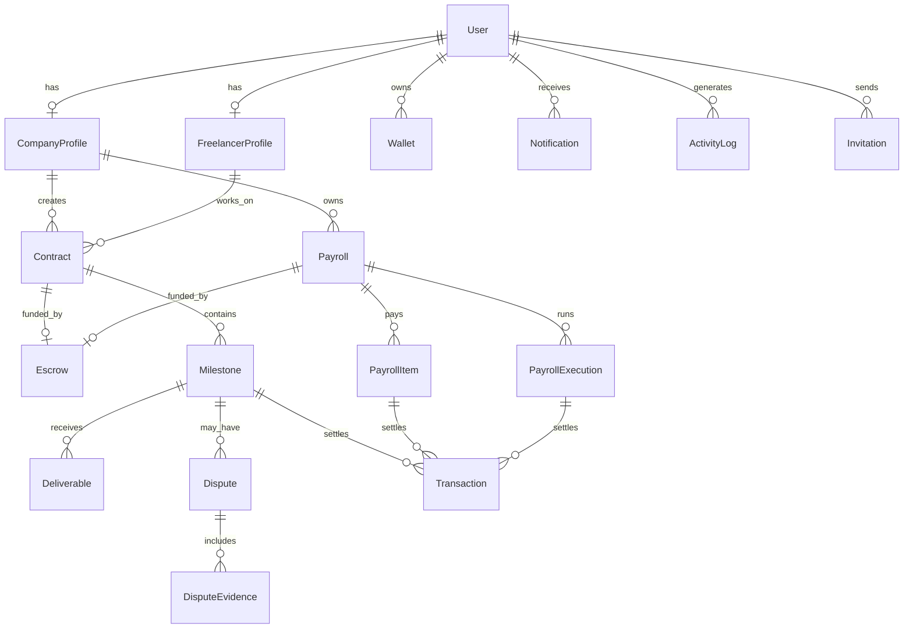

# Data Model

BolPay stores its off-chain state in PostgreSQL, modeled with Prisma. This document
describes the entities, their relationships, and the enumerations that drive the
domain state machines. On-chain references (escrow id, Stellar transaction hash) are
stored alongside the entities they relate to.

## 1. Entity-Relationship Diagram

## 2. Identity

| Entity | Description |
|---|---|
| **User** | Account root. Holds email, role, auth provider, and the linked Stellar address / Pollar wallet id. One user has at most one company or freelancer profile. |
| **Wallet** | Stellar address(es) linked to a user; one is marked primary. |
| **CompanyProfile** | Company information (name, description). Owns contracts and payrolls. |
| **FreelancerProfile** | Professional information (display name, headline). Works on contracts. |
| **Invitation** | Tokenized email invitation binding an email to a role until accepted or expired. |

Fixed employees are users with the `fixed_employee` role; they are paid through
payroll but do not own contracts.

## 3. Contracts, Milestones & Deliverables

| Entity | Description |
|---|---|
| **Contract** | Agreement between a company and a freelancer with a total amount, optional deadline, status, and an optional escrow reference. |
| **Milestone** | A 0-based, ordered unit of work within a contract with its own amount, deadline, and status. The position matches the on-chain milestone index. |
| **Deliverable** | A versioned submission (file and/or link) attached to a milestone, with a review status and optional company feedback. |

Monetary amounts use `Decimal(20, 7)` to match Stellar's 7-decimal precision.

## 4. Escrow & Settlement

| Entity | Description |
|---|---|
| **Escrow** | Reference to a Trustless Work escrow (Soroban contract id), its type (`contract` or `payroll`), status, asset, and funded/released amounts. |
| **Transaction** | Audit record of an on-chain operation (`fund`, `release`, `refund`, `payroll_distribution`) with the Stellar hash and confirmation time. |

A single `Escrow` model backs both contracts and payroll, distinguished by
`EscrowType`.

## 5. Disputes

| Entity | Description |
|---|---|
| **Dispute** | Raised against a milestone; pauses release and locks funds. Tracks status, outcome, split amounts, and resolver. |
| **DisputeEvidence** | Files and comments submitted by either party during a dispute. |

## 6. Payroll

| Entity | Description |
|---|---|
| **Payroll** | A recurring payment schedule owned by a company, with a frequency and next-run date. |
| **PayrollItem** | A recipient line: a linked platform user (fixed employee) or an external wallet, with an individual amount. |
| **PayrollExecution** | A single run of a payroll with its status and total distributed amount. |

## 7. Cross-cutting

| Entity | Description |
|---|---|
| **Notification** | Per-user message with a type, payload, and read flag; streamed in real time. |
| **ActivityLog** | Append-only event record (e.g. `user.registered`, `wallet.linked`) for auditing. |

## 8. Enumerations

| Enum | Values |
|---|---|
| `UserRole` | `company`, `freelancer`, `fixed_employee` |
| `AuthProvider` | `google`, `github`, `discord`, `email`, `wallet` |
| `ContractStatus` | `draft`, `pending_acceptance`, `changes_requested`, `accepted`, `active`, `completed`, `rejected` |
| `MilestoneStatus` | `pending`, `submitted`, `in_review`, `approved`, `released`, `disputed` |
| `DeliverableStatus` | `submitted`, `changes_requested`, `approved` |
| `EscrowType` | `contract`, `payroll` |
| `EscrowStatus` | `created`, `funded`, `releasing`, `released`, `disputed`, `closed` |
| `DisputeStatus` | `open`, `under_review`, `escalated`, `resolved`, `closed` |
| `DisputeOutcome` | `release_to_freelancer`, `refund_to_company`, `split` |
| `InvitationStatus` | `pending`, `accepted`, `revoked`, `expired` |
| `PayrollFrequency` | `weekly`, `biweekly`, `monthly` |
| `PayrollStatus` | `draft`, `funded`, `active`, `paused`, `completed` |
| `PayrollExecutionStatus` | `pending`, `succeeded`, `failed`, `partial` |
| `TransactionOperation` | `fund`, `release`, `refund`, `payroll_distribution` |

Enum values are shared with the clients through `@bolpay/shared` to keep the
database, API, and UI in sync.
