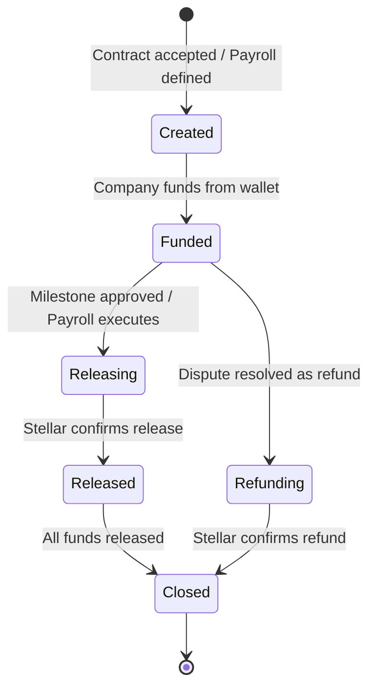
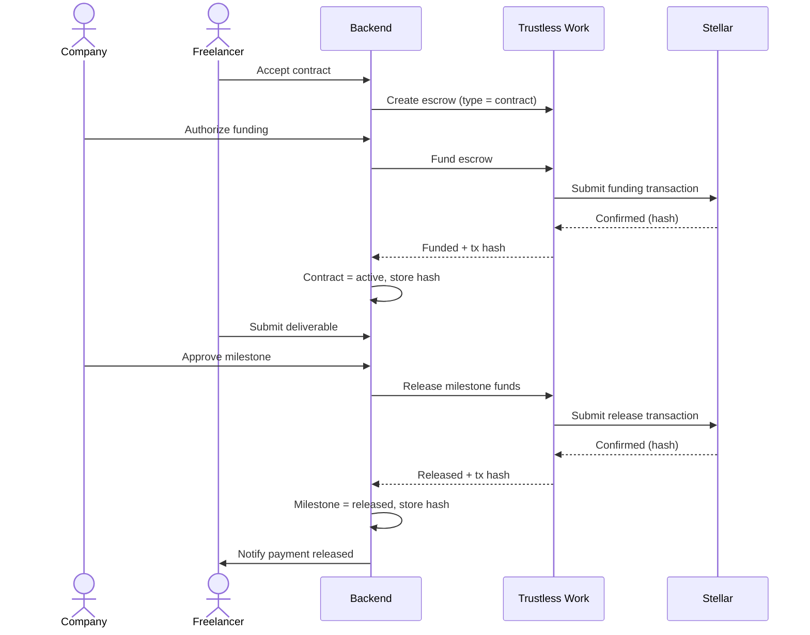
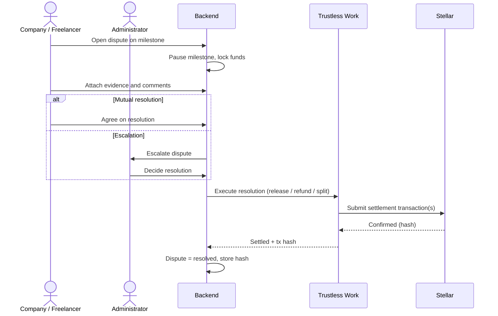
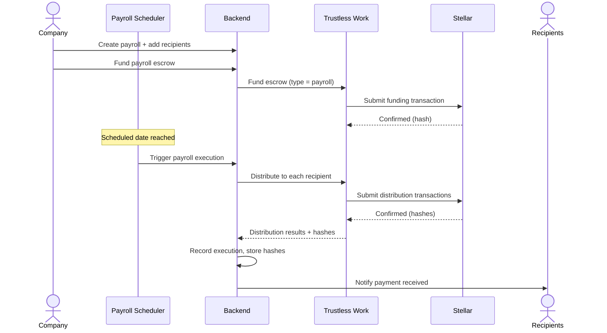

# Escrow and Payments

This document describes how BolPay locks and releases funds through Trustless Work
on the Stellar network. It covers the escrow lifecycle, the milestone payment flow,
the dispute resolution flow, and the payroll distribution flow. All settlement is
performed in USDC, and every operation produces a Stellar transaction hash that is
stored as the source of truth.

## 1. Principles

- **No custody of keys.** BolPay never stores private keys. Funding and release are
  authorized by the user's connected wallet; the backend only orchestrates the
  operations through Trustless Work.
- **On-chain source of truth.** A settlement is considered final only when its
  Stellar transaction is confirmed. The transaction hash is recorded against the
  corresponding domain entity.
- **Escrow as a Service.** Trustless Work provides the escrow primitives (create,
  fund, release, refund), removing the need to author and audit custom contracts.

## 2. Escrow Lifecycle

| State | Meaning |
|---|---|
| `Created` | The escrow exists in Trustless Work but holds no funds. |
| `Funded` | The company has funded the escrow from its wallet. |
| `Releasing` | A release has been requested and is awaiting on-chain confirmation. |
| `Released` | Funds have been released to the recipient and confirmed on Stellar. |
| `Refunding` | A refund has been requested as part of a dispute resolution. |
| `Closed` | The escrow has no remaining funds and is finalized. |

## 3. Milestone Payment Flow

This is the primary flow for freelance contracts: funds are locked at acceptance
and released per milestone upon approval.

## 4. Dispute Resolution Flow

When a dispute is opened, the affected milestone is paused and its funds remain
locked until the dispute is resolved. The resolution determines whether funds are
released to the freelancer, refunded to the company, or split.

## 5. Payroll Distribution Flow

Payroll reuses the escrow infrastructure for recurring distributions. The escrow is
funded ahead of time, and the scheduler distributes payments automatically on the
configured date.

## 6. Failure Handling and Idempotency

- **Asynchronous confirmation.** The interface acknowledges actions immediately,
  while settlement is confirmed asynchronously. Domain state that depends on
  settlement is finalized only after on-chain confirmation.
- **Retries.** Transient failures from Trustless Work or Stellar are retried. The
  backend surfaces actionable errors when an operation cannot complete.
- **Idempotent payroll.** Payroll execution is designed so that retrying after a
  partial failure does not double-pay recipients. Each recipient distribution is
  tracked individually, and a failed run can be marked `partial` and safely resumed.

## 7. Networks and Assets

| Aspect | Value |
|---|---|
| Settlement asset | USDC |
| Network (development) | Stellar Testnet |
| Smart contract platform | Soroban (via Trustless Work) |
| Source of truth | Stellar transaction hash per operation |
