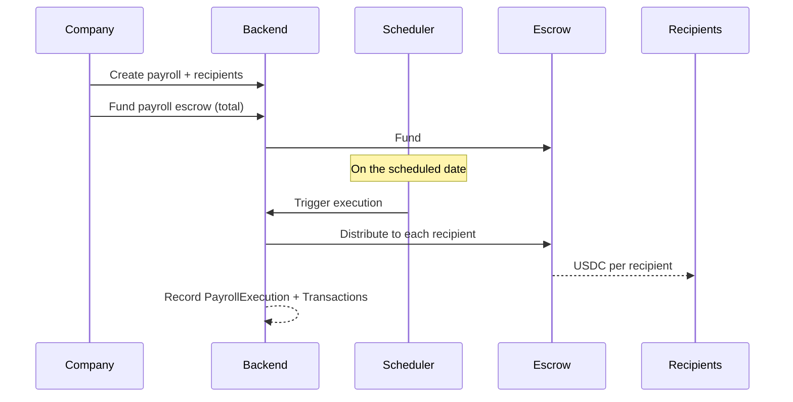

# Escrow & Payments

All value in BolPay settles in **USDC**, a native Stellar asset, through
decentralized escrow provided by [Trustless Work](https://www.trustlesswork.com/).
This document describes the escrow model, the two runtime modes, and the settlement
flows for contracts, disputes, and payroll.

## 1. Escrow Model

A BolPay escrow is a Trustless Work (Soroban) contract that locks funds until
release conditions are met. Two escrow types share the same abstraction:

- **Contract escrow** - multi-release: each milestone is an independently releasable
  tranche.
- **Payroll escrow** - funds a scheduled distribution to multiple recipients.

The backend stores a reference to each escrow (`trustlessWorkId`) and records every
on-chain operation as a `Transaction` with its Stellar hash, giving a verifiable
link between the database and the ledger.

## 2. Runtime Modes

Settlement is hidden behind an adapter (`EscrowChainAdapter`) selected by the
`ESCROW_MODE` environment variable:

| Mode | Behavior |
|---|---|
| `simulated` (default) | In-memory escrow; the full product flow works without touching the chain. Used for local development and functional testing. |
| `trustless_work` | Real multi-release escrows on the **Stellar Testnet** via the Trustless Work API. Requires `TRUSTLESS_WORK_API_KEY` and a funded platform signer. |

Both modes expose the same operations (`deploy`, `fund`, `release`, `refund`,
`distribute`), so application logic is identical regardless of mode.

## 3. Contract Settlement

```mermaid
sequenceDiagram
    participant C as Company
    participant API as Backend
    participant E as Escrow (Trustless Work)
    participant F as Freelancer

    F->>API: Accept contract
    API->>E: Deploy multi-release escrow (one tranche per milestone)
    C->>API: Fund escrow (total amount)
    API->>E: Fund
    E-->>API: funded
    Note over API: Funds locked
    F->>API: Submit deliverable
    C->>API: Approve milestone
    API->>E: Release milestone tranche
    E-->>F: USDC to freelancer wallet
    Note over API: Repeat per milestone; contract completes when all released
```

Milestone receivers are the freelancers' Pollar wallets, so released funds land
directly in their accounts.

The company signs a **single transaction** to approve each milestone; the platform
then executes the release to the freelancer's locked receiver address. It can only
pay that fixed address (never redirect or skim), so approval and payout together take
just one signature from the company.

## 4. Dispute Settlement

Opening a dispute on a milestone pauses its release and keeps the funds locked.
Neither party can release unilaterally. Resolution can be:

- **`release_to_freelancer`** - the milestone tranche is released to the freelancer.
- **`refund_to_company`** - the tranche is refunded to the company.
- **`split`** - the tranche is divided between both parties by agreed amounts.

Resolution is **fully mutual**: one party proposes a split (one of the outcomes above),
and the other party must **accept** it, or **counter-propose** their own, before
anything settles. There is no administrator arbiter, so the funds stay locked until
both sides agree. The agreed split is then executed on the escrow by the platform,
which can only pay the two parties' addresses (never redirect or skim).

## 5. Payroll Distribution



Each execution records a `PayrollExecution` and one `Transaction` per recipient with
its Stellar hash. Failed or partial executions are tracked so they can be retried.

## 6. Precision

Amounts use 7 decimal places throughout (`Decimal(20, 7)`), matching Stellar's
native asset precision, to avoid rounding drift between the database and on-chain
operations.
