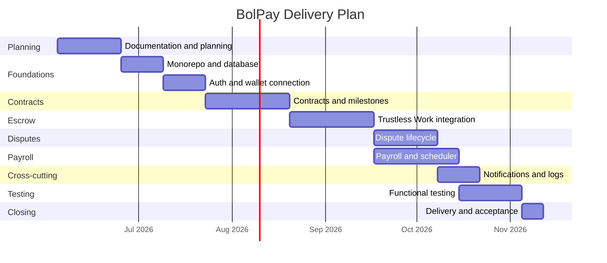

# Roadmap

This document defines the delivery plan for BolPay: the phases, milestones, work
breakdown structure, and timeline. Dates are planning targets and should be revised
as the project progresses.

## 1. Delivery Phases

| Phase | Name | Goal |
|---|---|---|
| 0 | Planning and Documentation | Produce the planning deliverables and validate scope. |
| 1 | Foundations | Scaffold the monorepo, set up the database, and establish authentication. |
| 2 | Contracts and Milestones | Implement the contract lifecycle and milestone management. |
| 3 | Escrow Integration | Integrate Trustless Work and settle milestone payments on Stellar Testnet. |
| 4 | Disputes | Implement the dispute lifecycle and resolution execution. |
| 5 | Payroll | Implement payroll schedules and automated on-chain distribution. |
| 6 | Notifications and Logs | Add real-time notifications and activity logging. |
| 7 | Testing and Hardening | Functional testing of contracts, payments, and escrows. |
| 8 | Closing | Final delivery, closing minutes, and acceptance. |

## 2. Milestones

| Milestone | Description | Phase |
|---|---|---|
| M0 | Planning deliverables approved | 0 |
| M1 | Monorepo scaffolded, authentication and roles working | 1 |
| M2 | Contracts and milestones functional end to end (off-chain) | 2 |
| M3 | Escrow funding and milestone release working on Testnet | 3 |
| M4 | Dispute resolution executing on escrow | 4 |
| M5 | Payroll distributing automatically on schedule | 5 |
| M6 | Notifications and activity logs integrated | 6 |
| M7 | Functional test suite passing in the test environment | 7 |
| M8 | Source code delivered and accepted | 8 |

## 3. Work Breakdown Structure (WBS)

```
1. BolPay
   1.1 Planning and Documentation
       1.1.1 Project charter
       1.1.2 Requirements specification
       1.1.3 Use-case and ER diagrams
       1.1.4 Architecture diagram
       1.1.5 Wireframes / mockups
       1.1.6 Risk analysis and schedule
   1.2 Foundations
       1.2.1 Monorepo scaffold (apps and shared package)
       1.2.2 PostgreSQL schema and migrations
       1.2.3 Authentication and role-based access control
       1.2.4 Wallet connection
   1.3 Contracts and Milestones
       1.3.1 Contract creation and lifecycle
       1.3.2 Milestone definition
       1.3.3 Deliverable submission and review
   1.4 Escrow Integration
       1.4.1 Trustless Work client and configuration
       1.4.2 Escrow creation and funding
       1.4.3 Milestone release and transaction recording
   1.5 Disputes
       1.5.1 Dispute lifecycle and evidence
       1.5.2 Mutual resolution and escalation
       1.5.3 Resolution execution on escrow
   1.6 Payroll
       1.6.1 Payroll schedules and recipients
       1.6.2 Escrow funding for payroll
       1.6.3 Scheduler and automated distribution
   1.7 Notifications and Logs
       1.7.1 Real-time notifications
       1.7.2 Activity logging
   1.8 Testing and Hardening
       1.8.1 Functional test scenarios
       1.8.2 Escrow and payment validation on Testnet
   1.9 Closing
       1.9.1 Final source-code delivery
       1.9.2 Closing minutes and acceptance letter
```

## 4. Timeline (Gantt)

The Gantt chart below shows the planned sequence and overlap of phases. Dates are
targets for planning purposes.



## 5. Dependencies and Sequencing Notes

- Phases 4 (Disputes) and 5 (Payroll) both depend on Phase 3 (Escrow Integration)
  and can proceed in parallel once escrow is functional.
- Phase 6 (Notifications and Logs) is cross-cutting and integrates with earlier
  modules as they are completed.
- Phase 7 (Testing) requires the payment and escrow flows from Phases 3 to 5 to be
  in place before functional validation on Testnet can be completed.

## 6. Definition of Done

A phase is considered done when:

- Its functional requirements (see [requirements.md](requirements.md)) are
  implemented and demonstrable.
- The relevant flows are validated against the Stellar Testnet where on-chain
  operations are involved.
- Changes are merged with passing tests and applied database migrations.
