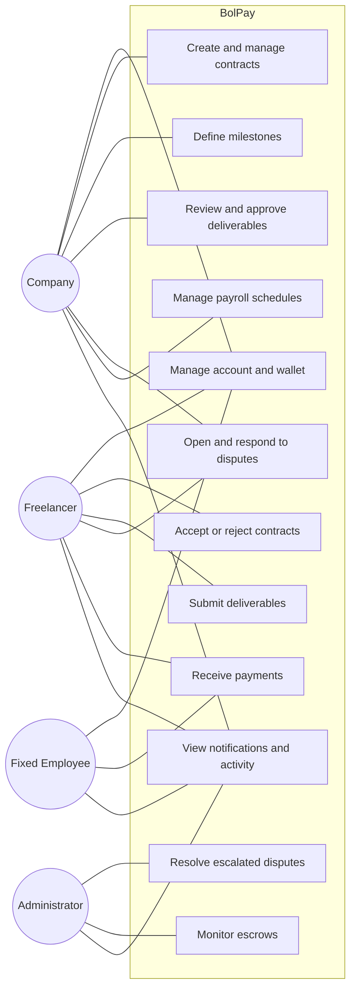

# Use Cases

This document describes how each role interacts with BolPay. It presents a
high-level use-case diagram, a use-case catalog, and detailed descriptions of the
most critical flows.

## 1. Actors

| Actor | Description |
|---|---|
| **Company** | Creates contracts, manages milestones, approves deliverables, and administers payroll. |
| **Freelancer** | Accepts contracts, submits deliverables, and receives milestone payments. |
| **Fixed Employee** | Receives recurring payments through payroll. |
| **Administrator** | Monitors escrows and resolves escalated disputes. |

## 2. Use-Case Diagram

## 3. Use-Case Catalog

| ID | Use Case | Primary Actor | Related Requirements |
|---|---|---|---|
| UC-01 | Register and connect a Stellar wallet | All | FR-USR-01, FR-USR-02 |
| UC-02 | Create a contract | Company | FR-CON-01 |
| UC-03 | Accept, reject, or request changes to a contract | Freelancer | FR-CON-03, FR-CON-04 |
| UC-04 | Define milestones | Company | FR-MIL-01 |
| UC-05 | Submit a deliverable | Freelancer | FR-MIL-02 |
| UC-06 | Review and approve a deliverable | Company | FR-MIL-03, FR-MIL-04 |
| UC-07 | Open a dispute | Company / Freelancer | FR-DIS-01, FR-DIS-02 |
| UC-08 | Resolve a dispute mutually | Company / Freelancer | FR-DIS-04, FR-DIS-06 |
| UC-09 | Escalate and resolve a dispute | Administrator | FR-DIS-05, FR-DIS-06 |
| UC-10 | Create and fund a payroll schedule | Company | FR-PAY-01, FR-PAY-02, FR-PAY-03 |
| UC-11 | Receive a payroll payment | Fixed Employee | FR-PAY-04, FR-PAY-06 |
| UC-12 | Monitor escrows | Administrator | FR-ESC-05, FR-LOG-02 |

## 4. Detailed Use Cases

### UC-02: Create a Contract

| Field | Description |
|---|---|
| **Actor** | Company |
| **Preconditions** | The company is authenticated and has a connected wallet. |
| **Trigger** | The company starts creating a new contract. |
| **Main flow** | 1. The company enters title, description, total amount, and expected deliverables. 2. The company defines one or more milestones with amounts and deadlines. 3. The system validates that milestone amounts sum to the total amount. 4. The system saves the contract in `draft` status and invites the freelancer. |
| **Postconditions** | A contract exists in `draft` status, pending the freelancer's response. |
| **Alternative flows** | If milestone amounts do not match the total, the system rejects the submission with a validation error. |

### UC-03: Accept a Contract and Fund Escrow

| Field | Description |
|---|---|
| **Actor** | Freelancer (acceptance), Company (funding authorization) |
| **Preconditions** | A contract exists in `draft` status and is assigned to the freelancer. |
| **Trigger** | The freelancer reviews the contract. |
| **Main flow** | 1. The freelancer accepts the contract. 2. The system creates an escrow through Trustless Work. 3. The company authorizes funding from its wallet. 4. The escrow is funded and the contract transitions to `active`. |
| **Postconditions** | The contract is `active`, the escrow is `funded`, and the funding transaction hash is recorded. |
| **Alternative flows** | The freelancer may reject the contract or request modifications, returning it to the company for revision. |

### UC-06: Review and Approve a Deliverable

| Field | Description |
|---|---|
| **Actor** | Company |
| **Preconditions** | A milestone has a submitted deliverable and the contract is `active`. |
| **Trigger** | The company reviews the submitted deliverable. |
| **Main flow** | 1. The company opens the deliverable and reviews it. 2. The company approves the milestone. 3. The system requests fund release through Trustless Work. 4. Stellar settles the release and returns a transaction hash. 5. The system marks the milestone as `released` and notifies the freelancer. |
| **Postconditions** | The milestone funds are released to the freelancer and the transaction hash is recorded. |
| **Alternative flows** | The company may request changes, returning the milestone to the freelancer for a new deliverable version. |

### UC-07: Open a Dispute

| Field | Description |
|---|---|
| **Actor** | Company or Freelancer |
| **Preconditions** | A milestone is active and not yet released. |
| **Trigger** | One party disagrees about a deliverable or milestone. |
| **Main flow** | 1. The party opens a dispute on the milestone. 2. The system pauses the milestone and locks its funds. 3. Both parties attach evidence and comments. 4. The parties reach a mutual resolution, or the dispute is escalated to an administrator. 5. The agreed resolution is executed on the escrow. |
| **Postconditions** | The dispute is `resolved` or `closed`, and the escrow reflects the executed resolution. |
| **Alternative flows** | If no mutual resolution is reached, an administrator resolves the escalated dispute (UC-09). |

### UC-10: Create and Fund a Payroll Schedule

| Field | Description |
|---|---|
| **Actor** | Company |
| **Preconditions** | The company is authenticated and has a connected, funded wallet. |
| **Trigger** | The company sets up recurring payments for a fixed team. |
| **Main flow** | 1. The company creates a payroll with a frequency (weekly, biweekly, or monthly). 2. The company adds recipients and individual amounts. 3. The company funds the payroll escrow. 4. On the scheduled date, the system distributes payments automatically to each wallet. 5. The system records each distribution's transaction hash and notifies recipients. |
| **Postconditions** | Recipients are paid on schedule and an execution record with transaction hashes exists. |
| **Alternative flows** | If the payroll escrow is insufficiently funded at execution time, the run is marked `failed` or `partial` and the company is notified. |
